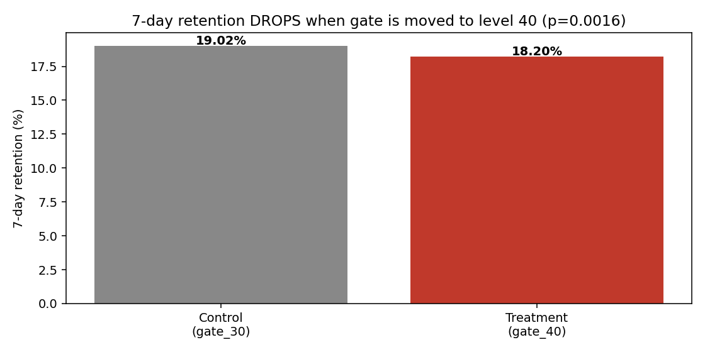
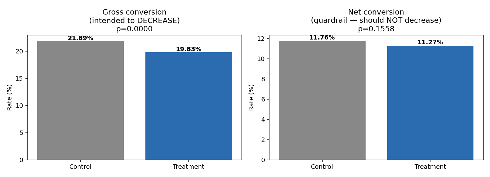
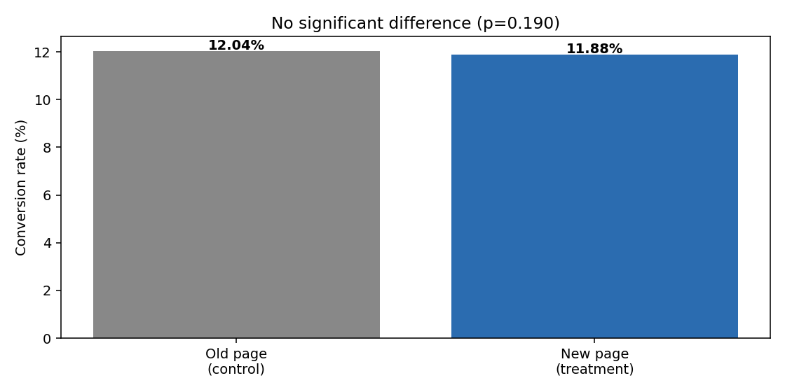
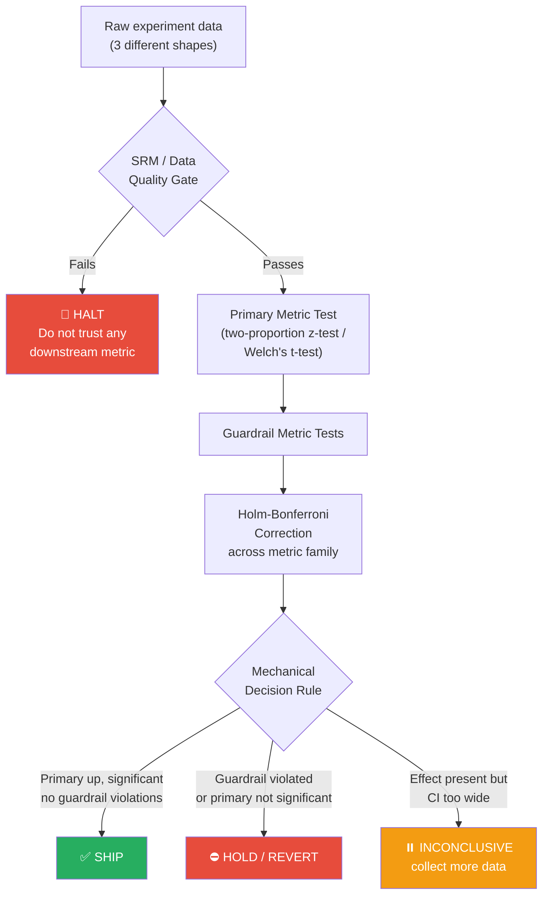

<div align="center">

# 🧪 A/B Testing & Experimentation Portfolio

### Three real-world experiments. One rigorous, reusable methodology.

[](https://www.python.org/)
[](https://www.statsmodels.org/)
[](https://pandas.pydata.org/)
[](https://jupyter.org/)
[](#license)

**No simulated data. No forced "ship it" conclusions.**
Every result below comes from a real, publicly verified dataset — and one of them says *don't ship*.

</div>

---

## 🎯 TL;DR

| Case Study | Real Dataset | Users | Verdict | Why It Matters |
|---|---|---:|---|---|
| 🎮 [Cookie Cats](case_studies/cookie_cats) | Mobile game gate placement A/B test | 90,189 | ❌ **Revert** | Primary metric significantly **regressed** — the intuitive change made things worse |
| 🎓 [Udacity Funnel](case_studies/udacity_funnel) | Free-trial screener funnel test | 37 days | ⏸️ **Hold** | Genuinely **inconclusive** — resisted the temptation to force a decision |
| 🛒 [Landing Page](case_studies/website_conversion) | E-commerce conversion test | 294,478 | ⚠️ **No lift + bug caught** | Found a data bug that a **standard SRM check completely misses** |

📄 **Full write-up:** [`reports/executive_summary_all_cases.md`](reports/executive_summary_all_cases.md)

---

## 📊 The results, visually

<table>
<tr>
<td width="33%" align="center">

**Cookie Cats — 7-day retention**



Moving the gate to level 40 **significantly hurt** retention (p ≈ 0.005)

</td>
<td width="33%" align="center">

**Udacity — Gross vs. Net conversion**



Intended effect confirmed, guardrail effect **inconclusive**

</td>
<td width="33%" align="center">

**Landing Page — Conversion rate**



No significant difference after cleaning a real assignment bug

</td>
</tr>
</table>

---

## 🧩 Why this project is different from a typical "A/B test portfolio"

Most portfolio A/B test projects run a single t-test on a clean, single-purpose
dataset and call it done. This one is built to demonstrate the parts that
actually matter in a real experimentation function:

- ✅ **Sample Ratio Mismatch (SRM) gating** *before* trusting any metric
- ✅ **Pre-specified primary + guardrail metrics** — not picked after seeing results
- ✅ **Multiple-comparisons correction** (Holm-Bonferroni) across metric families
- ✅ **A data-quality bug that SRM structurally cannot catch** (Case Study 3) — and a second check that does
- ✅ **A real regression** (Case Study 1) and a **real "we don't know yet"** (Case Study 2) — not everything is a clean win
- ✅ **One shared statistical toolkit** applied consistently across 3 different data shapes (user-level booleans, daily-aggregate counts, single binary outcome)

---

## ⚙️ How the pipeline works



This exact flow — implemented once in [`shared/stats_toolkit.py`](shared/stats_toolkit.py)
— is applied identically to all three case studies below, regardless of
whether the input is user-level rows or daily-aggregate counts.

---

## 📁 Repository structure

```
ab-test-guardrail-metrics/
│
├── README.md                              <- you are here
├── reports/executive_summary_all_cases.md <- start here for the full narrative
│
├── shared/
│   └── stats_toolkit.py                   <- SRM check, z-tests, Welch's t-test,
│                                              Holm-Bonferroni, power analysis
│
├── case_studies/cookie_cats/
│   ├── cookie_cats.csv                    <- real data, 90,189 players
│   ├── analysis.py                        <- pipeline script
│   └── notebooks/cookie_cats_analysis.ipynb (+ .html)
│
├── case_studies/udacity_funnel/
│   ├── udacity_control.csv / udacity_experiment.csv
│   ├── analysis.py
│   └── notebooks/udacity_funnel_analysis.ipynb (+ .html)
│
├── case_studies/website_conversion/
│   ├── ab_data.csv                        <- real data, 294,478 users
│   ├── analysis.py
│   └── notebooks/website_conversion_analysis.ipynb (+ .html)
│
└── data/ + scripts/                       <- appendix: simulated dataset used
                                               only to validate the pipeline
                                               itself before trusting it on
                                               real data (see note below)
```

---

## 🔍 Case Study Deep Dives

### 1️⃣ Cookie Cats — Should the progression gate move from level 30 to level 40?

**Hypothesis:** delaying the first forced-wait gate lets players build more
investment before hitting friction, improving retention.

**Result:** the opposite happened. 7-day retention **dropped significantly**
(19.02% → 18.20%, **−4.3% relative**, Holm-adjusted p ≈ 0.005).

> 📓 [Full notebook](case_studies/cookie_cats/notebooks/cookie_cats_analysis.html) · [Analysis script](case_studies/cookie_cats/analysis.py)

---

### 2️⃣ Udacity Free Trial Screener — Does a commitment screener improve funnel quality?

**Hypothesis:** asking students to self-report weekly time commitment filters
out low-commitment free-trial signups without hurting paying customers.

**Result:** gross conversion dropped as intended (**−9.4%**, p ≈ 0.00001), but
net conversion (paying customers) also dropped **without reaching
significance** — the 95% CI `[-1.16pp, +0.19pp]` can't rule out a real
revenue cost.

> 🎯 **The point:** this is a genuine "we need more data" result, reported
> honestly instead of rounding to a false yes/no.

> 📓 [Full notebook](case_studies/udacity_funnel/notebooks/udacity_funnel_analysis.html) · [Analysis script](case_studies/udacity_funnel/analysis.py)

---

### 3️⃣ Landing Page Redesign — Does the new page convert better?

**Result:** no significant lift (11.88% vs. 12.04%, p = 0.19).

**The more important finding:** raw group sizes passed a standard SRM check
almost perfectly (50.01% vs. 50.00%, p = 0.89) — but **1.3% of rows had a
real group/page assignment bug** invisible to that check, because SRM only
validates aggregate counts, not per-user integrity. A second, unit-level
check caught it.

> 📓 [Full notebook](case_studies/website_conversion/notebooks/website_conversion_analysis.html) · [Analysis script](case_studies/website_conversion/analysis.py)

---

## 🗂️ Data provenance

All three datasets are real and independently verified against previously
published analyses of the same data (matching totals, matching known
conclusions) before being used here:

| Dataset | Source |
|---|---|
| Cookie Cats | Tactile Entertainment's real mobile A/B test, released via a DataCamp project |
| Udacity Free Trial Screener | Real Udacity experiment, released as daily aggregate funnel counts |
| Landing page (`ab_data.csv`) | Real e-commerce conversion test, widely used in "Analyze A/B Test Results" projects |

## 📌 Appendix: pipeline-validation dataset

`data/` contains a separate, clearly-labeled **simulated** dataset with a
known injected ground truth, used only to validate that the SRM check and
guardrail logic actually catch real problems before being trusted on the
real datasets above. It is not presented as a fourth case study — see
`data/GROUND_TRUTH.json` for details.

---

## 🚀 Reproduce any case study

```bash
git clone https://github.com/ArchanaChetan07/ab-test-guardrail-metrics.git
cd ab-test-guardrail-metrics/case_studies/<case_study_name>

python3 analysis.py                                     # run the pipeline
jupyter nbconvert --to notebook --execute --inplace notebooks/*.ipynb
jupyter nbconvert --to html notebooks/*.ipynb
```

**Requirements:** `pandas`, `numpy`, `scipy`, `statsmodels`, `matplotlib`, `jupyter`, `nbconvert`, `nbformat`

---

## 💡 What this project demonstrates

| Skill | Where it shows up |
|---|---|
| Experimental design | Pre-specified metrics before analysis, in each case study's writeup |
| Statistical rigor | Correct test selection per data type, Holm-Bonferroni correction |
| Data quality instincts | SRM checks + a bug SRM alone doesn't catch (Case 3) |
| Judgment under ambiguity | A regression, an inconclusive result, and a null — not three clean wins |
| Engineering discipline | One shared, reusable toolkit instead of copy-pasted stats per notebook |
| Communication | Executive summary for stakeholders, full notebooks for technical reviewers |

---

<div align="center">

📫 Questions or feedback? Open an issue or reach out.

</div>
