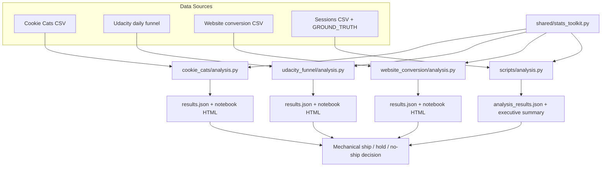

# A/B Test Guardrail Metrics

### Pre-registered primary metrics, guardrail checks, SRM gating, and Holm-Bonferroni correction across four real experiments

[](https://www.python.org/)
[](case_studies/)
[](shared/stats_toolkit.py)
[](#license)

Experimentation portfolio applying one consistent analysis standard — sample-ratio mismatch (SRM) checks, pre-specified primary/guardrail metrics, Holm-Bonferroni family-wise correction, and mechanical ship/no-ship rules — to **four experiments** spanning user-level booleans, daily funnel aggregates, and session-level checkout data. Includes reproducible Python pipelines, Jupyter/HTML notebooks, and JSON result artifacts.

---

## Key Results

| Metric | Value | Source |
|---|---|---|
| Case studies (real datasets) | **3** (Cookie Cats, Udacity funnel, e-commerce landing page) | `case_studies/` |
| Cookie Cats users | **90,189** | `case_studies/cookie_cats/cookie_cats.csv` |
| Cookie Cats 7-day retention | **−4.3%** relative (Holm p ≈ **0.005**) → **DO NOT SHIP** | `case_studies/cookie_cats/reports/results.json` |
| Udacity funnel window | **37 days** (daily aggregates) | `case_studies/udacity_funnel/udacity_control.csv` |
| Udacity gross conversion | **−9.4%** relative (Holm p ≈ **5e-06**) → **HOLD (inconclusive)** | `case_studies/udacity_funnel/reports/results.json` |
| E-commerce landing page rows | **294,478** raw → **290,584** after integrity cleaning | `case_studies/website_conversion/reports/results.json` |
| Checkout-flow sessions (synthetic) | **102,710** | `data/sessions.csv` |
| Shared stats functions | **6** (SRM, z-test, Welch, Holm, power, sample size) | `shared/stats_toolkit.py` |
| Analysis notebooks | **4** (HTML exports included) | `notebooks/`, `case_studies/*/notebooks/` |

---

## Architecture



**How it works:** each case study loads its dataset, runs SRM and data-integrity gates, tests a pre-registered primary metric plus guardrails (two-proportion z-tests or Welch's t-test), applies Holm-Bonferroni correction across the metric family, and emits a JSON decision with documented reasons. The checkout-flow experiment additionally checks novelty effects (early vs late window lift) and validates against `GROUND_TRUTH.json`.

---

## Tech Stack

| Layer | Choice |
|---|---|
| Language | Python 3 |
| Stats | scipy, statsmodels (proportions_ztest, multipletests, NormalIndPower) |
| Data | pandas, numpy |
| Notebooks | Jupyter (exported HTML in repo) |
| Outputs | JSON results, markdown executive summaries |

---

## Features

- **SRM check** with p < 0.001 threshold (stricter than α=0.05)
- **Holm-Bonferroni** correction across primary + guardrail metric families
- **Guardrail rules** — e.g., flag AOV drop >2%, support-contact rate degradation
- **Data-quality gate** beyond SRM (group/page assignment mismatch detection on e-commerce data)
- **Novelty effect** day-by-day lift analysis for checkout-flow experiment
- **Mechanical decisions** — regression, inconclusive, and null outcomes documented honestly
- Shared `stats_toolkit.py` reused across all case studies for methodology consistency

---

## Installation & Usage

```bash
git clone https://github.com/ArchanaChetan07/ab-test-guardrail-metrics.git
cd ab-test-guardrail-metrics
python -m venv .venv
# Windows: .venv\Scripts\activate
source .venv/bin/activate
pip install pandas numpy scipy statsmodels jupyter
```

```bash
# Case study 1 — Cookie Cats gate placement
cd case_studies/cookie_cats && python analysis.py

# Case study 2 — Udacity free-trial screener funnel
cd ../udacity_funnel && python analysis.py

# Case study 3 — Landing page redesign
cd ../website_conversion && python analysis.py

# Checkout-flow experiment (synthetic sessions + guardrails)
cd ../../scripts && python analysis.py
```

Open the HTML notebooks under each `notebooks/` folder for full walkthroughs. See `reports/executive_summary_all_cases.md` for cross-case decisions.

---

## Project Structure

```text
ab-test-guardrail-metrics/
├── shared/stats_toolkit.py          # SRM, z-test, Welch, Holm, power
├── case_studies/
│   ├── cookie_cats/                 # 90,189 users, retention regression
│   ├── udacity_funnel/              # 37-day daily funnel aggregates
│   └── website_conversion/          # 294k rows, assignment-bug demo
├── scripts/
│   ├── analysis.py                  # checkout-flow + guardrails + novelty
│   └── generate_data.py
├── data/
│   ├── sessions.csv                 # 102,710 synthetic sessions
│   └── GROUND_TRUTH.json            # pipeline validation answer key
├── reports/
│   ├── analysis_results.json
│   └── executive_summary_all_cases.md
└── notebooks/                       # root checkout-flow notebook
```

---

## Future Improvements

- Add pytest coverage for `stats_toolkit.py` edge cases
- GitHub Actions to re-run all four analyses and diff JSON outputs
- requirements.txt pinning scipy/statsmodels versions
- Interactive Streamlit dashboard over saved `results.json` files

---

## License

See repository license file if present.
