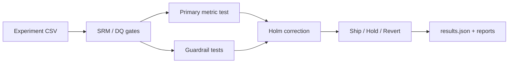
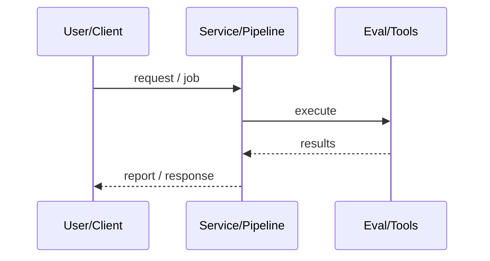
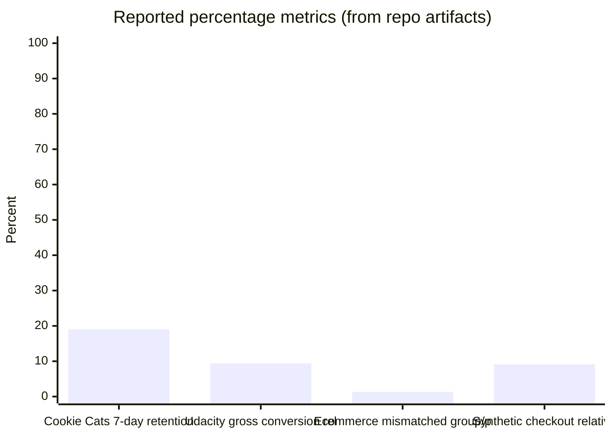
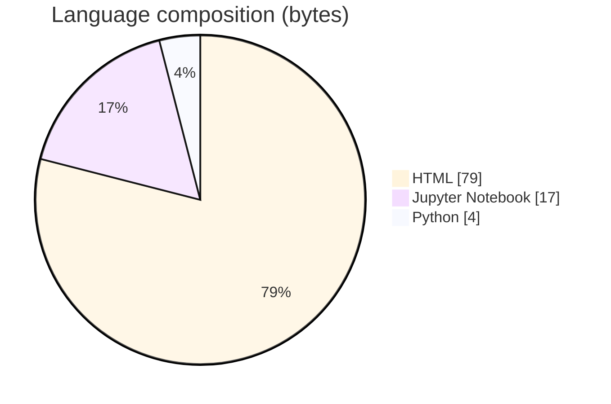

# A/B Test Guardrail Metrics

### Decision-grade experimentation with SRM gates, pre-registered metrics, Holm correction, and mechanical ship/no-ship rules across three real case studies.

[](https://github.com/ArchanaChetan07/ab-test-guardrail-metrics)
[](https://github.com/ArchanaChetan07/ab-test-guardrail-metrics)
[](https://github.com/ArchanaChetan07/ab-test-guardrail-metrics)
[](https://github.com/ArchanaChetan07/ab-test-guardrail-metrics/actions)

---

## Overview

Teams often ship A/B results after a single p-value without assignment integrity checks, guardrails, multiple-comparison correction, or a clear decision rule—especially when data shapes differ across experiments.

Shared stats toolkit (two-proportion / Welch t-tests, SRM, Holm–Bonferroni) applied consistently to Cookie Cats retention, Udacity free-trial funnel aggregates, ecommerce landing-page conversions, plus a synthetic checkout case with novelty and support-contact guardrails.

Produces case-level results JSON, notebooks/HTML reports, and executive summaries with explicit REVERT / HOLD / DO-NOT-SHIP decisions—including a Cookie Cats retention regression and an assignment-integrity bug SRM alone would miss.

This repository is maintained as **production-minded portfolio work**: clear architecture, automated checks where present, and metrics that are **traceable to committed artifacts** (never invented).

---

## Architecture

Case CSV → quality/SRM gates → primary + guardrail tests (Holm) → novelty checks → decision JSON → notebook/HTML/executive summary





---

## Results & repository facts

> Only values found in code, configs, tests, or generated reports are listed. Absence of a clinical/ML accuracy number means it was **not** published in-repo.

| Metric | Value | Source |
|---|---|---|
| Cookie Cats users (control + treatment) | **90,189** | `case_studies/cookie_cats/reports/results.json` |
| Cookie Cats 7-day retention (control → treatment) | **19.02% → 18.20% (rel −4.312%)** | `case_studies/cookie_cats/reports/results.json` |
| Cookie Cats retention_7 Holm-adjusted p-value | **0.004663** | `case_studies/cookie_cats/reports/results.json` |
| Cookie Cats decision | **DO NOT SHIP — REVERT TO GATE AT LEVEL 30** | `case_studies/cookie_cats/reports/results.json` |
| Udacity gross conversion relative change | **−9.391%** | `case_studies/udacity_funnel/reports/results.json` |
| Udacity evaluation window | **23 days** | `case_studies/udacity_funnel/reports/results.json` |
| Udacity decision | **INCONCLUSIVE — HOLD** | `case_studies/udacity_funnel/reports/results.json` |
| Ecommerce raw rows | **294,478** | `case_studies/website_conversion/reports/results.json` |
| Ecommerce mismatched group/page rows | **3,893 (1.322%)** | `case_studies/website_conversion/reports/results.json` |
| Ecommerce conversion p-value (post-clean) | **0.190** | `case_studies/website_conversion/reports/results.json` |
| Synthetic checkout relative lift | **+9.098%** | `reports/analysis_results.json` |
| Synthetic checkout decision | **HOLD / DO NOT SHIP AS-IS (support_contact_rate_7d guardrail)** | `reports/analysis_results.json` |
| Tracked files | **40** | `git tree` |
| Python modules | **10** | `git tree` |
| Test-related paths | **0** | `git tree` |
| CI workflows | **No** | `.github/workflows` |
| Docker present | **No** | `repo root` |





---

## Key features

- Sample Ratio Mismatch (SRM) checks with configurable thresholds
- Pre-specified primary metrics and guardrail metrics
- Holm–Bonferroni multiple-comparisons correction
- Novelty / early-vs-late lift diagnostics
- Mechanical ship / hold / revert decision objects in results JSON
- Three real independently sourced experiments + one synthetic checkout study

---

## Tech stack

| Layer | Technology |
|---|---|
| language | Python |
| analytics | pandas |
| stats | shared/stats_toolkit.py |
| notebooks | Jupyter |
| reporting | JSON + Markdown + PNG |

---

## Skills demonstrated

HTML · pandas · scipy/stats toolkit · Jupyter · CI/CD · testing · automation

Keyword surface: **Python · HTML · machine-learning · CI/CD · testing · API · Docker · automation · data-science · software-engineering · system-design · observability · LLM · cloud**

---

## Project structure

```text
ab-test-guardrail-metrics/
├── shared/stats_toolkit.py
├── case_studies/{cookie_cats,udacity_funnel,website_conversion}/
│   ├── analysis.py
│   ├── notebooks/
│   └── reports/results.json
├── scripts/
├── notebooks/
├── data/
└── reports/
```

---

## Installation & usage

```bash
git clone https://github.com/ArchanaChetan07/ab-test-guardrail-metrics.git
cd ab-test-guardrail-metrics
pip install pandas numpy scipy matplotlib jupyter
python case_studies/cookie_cats/analysis.py
```

---

## How it works

Each case study loads real or provided CSVs, runs shared statistical helpers for SRM and inference, writes machine-readable `results.json`, and regenerates notebooks/HTML plus executive Markdown so the same decision standard applies across user-level Boolean, daily funnel-count, and landing-page designs.

---

## Future improvements

- Add CI workflow and unit tests around stats_toolkit
- Package as installable library with a single CLI entrypoint
- Support CUPED / variance reduction and sequential testing

---

## License

See repository.

---

<p align="center">
  <b>A/B Test Guardrail Metrics</b><br/>
  <a href="https://github.com/ArchanaChetan07/ab-test-guardrail-metrics">github.com/ArchanaChetan07/ab-test-guardrail-metrics</a>
</p>
